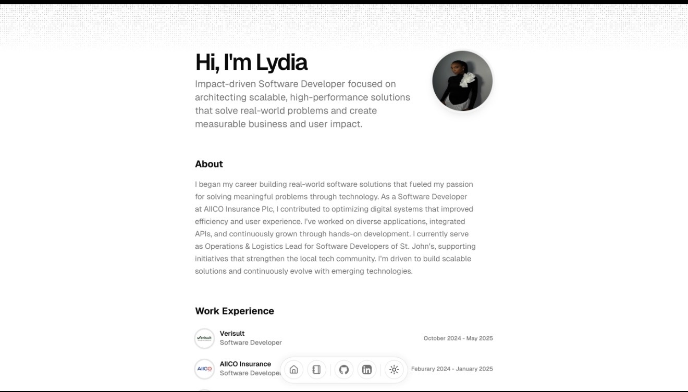

<div align="center">
  <a href="https://design-portfolio-flame-phi.vercel.app">
    
  </a>
</div>

# Portfolio [](https://design-portfolio-flame-phi.vercel.app)

Built with next.js and [magic ui](https://magicui.design/), deployed on Vercel.

# Features

- Built using Next.js 16, React, Typescript, Shadcn/UI, TailwindCSS, Framer Motion, Magic UI
- Includes a blog
- Responsive for different devices
- Optimized for Next.js and Vercel

# Getting Started Locally

1. Clone this repository to your local machine:

   ```bash
   git clone https://github.com/fikayo1999/Design-Portfolio/edit/main/README.md
   ```

2. Move to the cloned directory

   ```bash
   cd portfolio
   ```

3. Install dependencies:

   ```bash
   npm install
   ```

4. Start the local Server:

   ```bash
   npm dev
   ```

5. Open the [Config file](./src/data/resume.tsx) and make changes

# License

Licensed under the [MIT license](https://github.com/fikayo1999/Design-Portfolio/edit/main/README.md).
